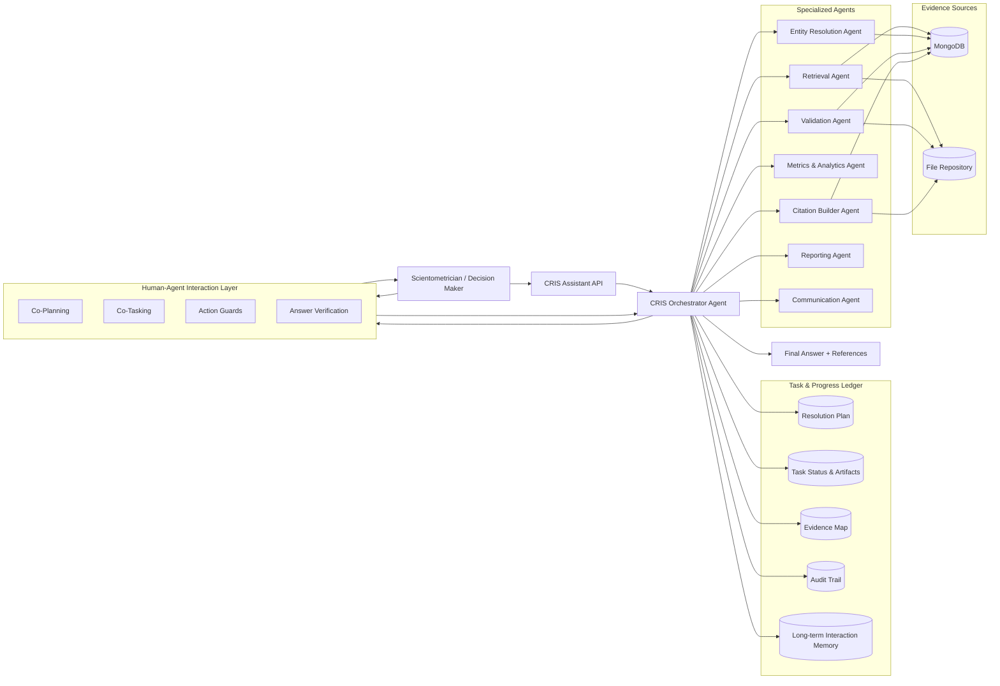

# CRIS Multi-Agent Assistant Architecture

## Magentic Orchestration + Magentic-UI (Human-Centered) Adaptation

## Purpose

This document specifies a production-grade **multi-agent architecture for a CRIS
(Current Research Information System)** that supports **scientometric analysis and
decision-making**, providing **accurate, referenced, auditable answers**.

It adapts:

- **Microsoft Magentic Orchestration** pattern
- **Magentic-UI (arXiv:2507.22358)** human-centered agent interaction mechanisms

This document is intended to be **directly consumable by an AI programming agent
(Copilot / Cursor / GPT-Engineer)**.

---

## 1. Problem Context

The system must answer questions about:

- Research outputs (articles, books, datasets, software, patents)
- Authors / researchers
- Institutions, faculties, departments
- Research groups and projects
- Productivity, impact, collaboration, trends

**Key requirement:**

Every answer must be **fully traceable to evidence** stored in:

1. **MongoDB** (structured CRIS data)
2. **A file repository** (PDF, DOCX, CSV, JSON, etc.)

---

## 2. Design Principles (from Magentic & Magentic-UI)

- Central **Orchestrator owns control flow**
- Agents have **single, bounded responsibilities**
- **Ledger is the source of truth**
- Humans are **first-class participants**
- All claims must be **evidence-backed**
- Ambiguity triggers **co-planning or co-tasking**
- High-impact actions require **action guards**

---

## 3. High-Level Architecture



---

## 4. Core Workflow (Magentic Control Loop)

```text
while goal_not_resolved:
    plan = co_plan_if_needed(user_query)
    resolve_entities()
    retrieve_evidence()
    validate_consistency()
    compute_metrics()
    build_citations()
    draft_report()
    if uncertainty_or_policy_triggered:
        human_review()
    evaluate_goal_completion()
```

---

## 5. Domain Model (CRIS Entities)

### Core entities

- **Person (Author/Researcher)**
  `internal_id, ORCID, aliases, affiliations_over_time`
- **Organization**
  Institution → Faculty → Department hierarchy
- **Research Group**
- **Research Output**
  `type, DOI/ISBN/handle, year, venue, authors`
- **Project / Funding**
- **Affiliation (temporal relationship)**

---

## 6. Specialized Agents

### 6.1 CRIS Orchestrator Agent

#### Responsibilities

- Interpret intent
- Generate and adapt plans
- Delegate tasks
- Enforce evidence & confidence thresholds
- Trigger human interaction

---

### 6.2 Entity Resolution Agent

- Disambiguates authors, groups, org units
- Uses rules + fuzzy matching + optional embeddings
- Outputs confidence scores
- Requests human co-tasking if confidence < threshold

---

### 6.3 Retrieval Agent

- Queries MongoDB collections
- Searches and extracts file evidence
- Returns raw evidence bundles

---

### 6.4 Validation & Consistency Agent

- Deduplicates outputs
- Detects metadata conflicts
- Flags missing or contradictory data

---

### 6.5 Metrics & Analytics Agent

Computes only **data-supported indicators**, e.g.:

- Output counts per year/unit/group
- Collaboration networks
- Productivity rankings

---

### 6.6 Citation Builder Agent

- Maps every claim to explicit evidence
- Enforces citation completeness

#### Citation examples

- `mongodb:outputs/<objectId>#doi,year`
- `file:reports/annual_2023.pdf#page=14`

---

### 6.7 Reporting Agent

- Produces:
  - Executive summary
  - Tables
  - Methods & filters
  - Limitations
- Outputs Markdown (exportable to PDF/HTML)

---

### 6.8 Communication Agent

- Asks clarification questions
- Notifies about human review steps
- Distributes final artifacts

---

## 7. Human-Centered Interaction (from Magentic-UI)

| Mechanism | CRIS Use Case |
| --------- | ------------- |
| Co-Planning | Clarify scope, years, units, definitions |
| Co-Tasking | Resolve ambiguous authors or affiliations |
| Action Guards | Prevent entity merges or deletions |
| Answer Verification | Validate high-impact reports |
| Long-Term Memory | Learn preferred resolution patterns |

---

## 8. Task & Progress Ledger

### Ledger stores

- request_id
- user_query
- plan
- task states
- evidence map
- final outputs
- human interactions
- audit events

### Ledger enables

- Reproducibility
- Resumability
- Full auditability

---

## 9. APIs (Minimal)

### Public

- `POST /v1/query`
- `GET /v1/query/{id}`
- `GET /v1/query/{id}/report`
- `GET /v1/query/{id}/evidence`
- `POST /v1/query/{id}/human-feedback`

### Internal tools

- MongoDB search
- File search & extraction
- Metrics computation
- Citation validation

---

## 10. Evidence Rules

- No numeric claim without citation
- All filters must be logged
- Conflicts must be reported, not hidden
- Confidence scores must be exposed

---

## 11. Implementation Blueprint

```text
cris-agent-system/
  api/
  orchestrator/
  agents/
    entity_resolution/
    retrieval/
    validation/
    metrics/
    citations/
    reporting/
    communication/
  ledger/
  tools/
  configs/
  docs/
```

---

## 12. Completion Criteria

A request is **resolved** only if:

- Entities are resolved or human-confirmed
- Evidence is collected and validated
- Metrics are reproducible
- All claims have citations
- Final report is generated and logged

---

## 13. References

- Microsoft AI Agent Design Patterns - Magentic Orchestration
- Magentic-UI: Human-Centered Multi-Agent Framework (arXiv:2507.22358)
